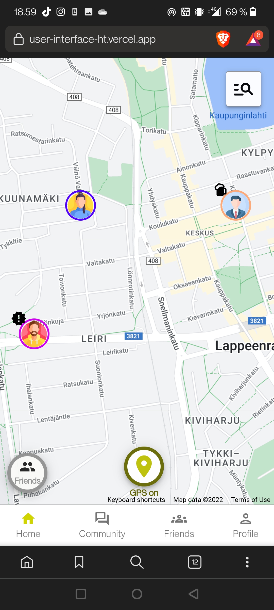

# UserInterface_HT

This repository contains the two user interfaces created for the User Interface and Usability course project.

## React prototype

  

<h3>
  How to run
</h3>
No need to run anything, the UI is available at: https://user-interface-ht.vercel.app/

## React Native prototype

  

#### How to run
1. 
Only supports Android phones as for the Iphones you need to create account and added as contributor to access it...
 -https://expo.dev/@zonkel/react-native-prototype?serviceType=classic&distribution=expo-go
