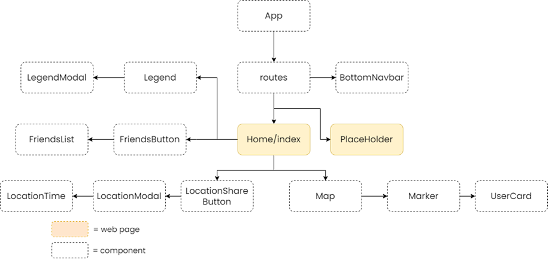

# UserInterface_HT

This repository contains the two user interfaces created for the User Interface and Usability course project.

## React prototype

  

### How to run
1. No need to compile anything as the already built version is available at: https://user-interface-ht.vercel.app/

### Project structure

  

# Optional
## React Native prototype

  

### How to run
(Android only)
1. Download expo app from google play store 
2. Go to https://expo.dev/@zonkel/react-native-prototype?serviceType=classic&distribution=expo-go
3. Scan the QR-code with the expo app
